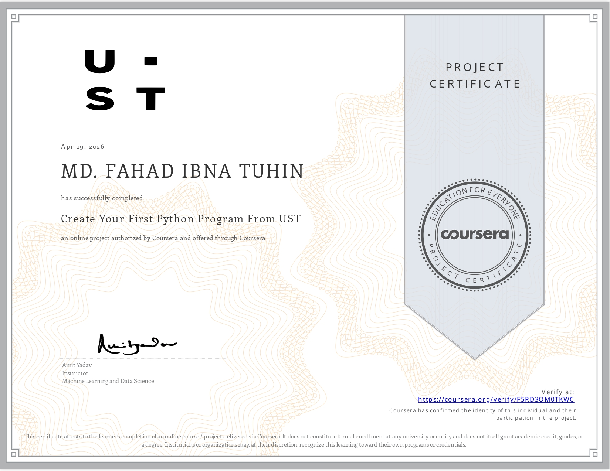

# Create_Your_First_Python_Program_From_UST_Fahad
Course link: https://www.coursera.org/projects/first-python-program-ust

## 📜 Certificate

🔗 Verify Certificate:  
https://www.coursera.org/account/accomplishments/certificate/F5RD3OM0TKWC

---

## 📚 What I Learned
- Fundamental Python syntax (variables, functions, loops, lists)
- Building a To-Do List application
- Writing command-line applications in Python
- Using Terminal and Text Editor

---

## 🛠 Skills Practiced
- Development Environment setup  
- Scripting & Programming basics  
- Data Structures  
- Command-Line Interface (CLI)  
- Unix Shell & Bash  
- Python Programming fundamentals  

---

## 🧰 Tools Used
- Python  
- Command-Line Interface  
- Unix Shell  
- Bash  
- Text Editor  

---